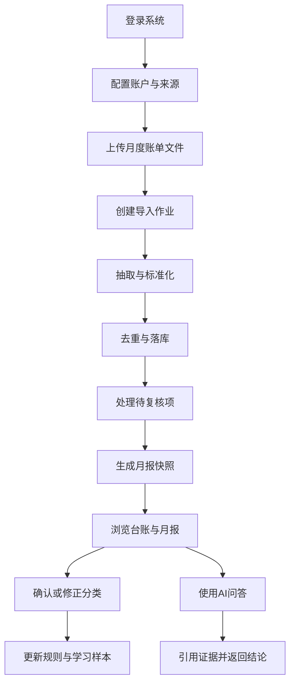

# FinAtlas 产品需求文档

## 1. 产品概述
FinAtlas 是一个单用户自用的个人财务管理 Web 平台，通过文件导入统一汇总银行、信用卡与基金平台数据，并在结构化数据之上提供证据可追溯的报表、分类和 AI 问答能力。
- 解决资产分散、消费分类混乱、投资全局不清晰、月度复盘成本高的问题
- 目标价值是用“每月一次导入”的低成本方式，构建稳定可解释的个人财务驾驶舱

## 2. 核心功能

### 2.1 用户角色
| 角色 | 注册方式 | 核心权限 |
|------|----------|----------|
| 单用户管理员 | 本地管理员账号 | 登录系统、管理账户来源、上传账单、修正分类、查看报表、使用 AI 助手、执行审计相关操作 |

### 2.2 功能模块
1. **首页 Dashboard**：净资产摘要、当月现金流、导入任务状态、报表入口、AI 问答快捷入口
2. **导入中心**：来源选择、文件上传、导入任务列表、任务详情、错误与待复核项处理
3. **交易台账**：交易列表、筛选器、详情抽屉、证据链查看、手工补录与编辑
4. **投资台账**：基金交易列表、平台筛选、基金维度聚合、分红与费用视图
5. **分类管理**：通用预算分类树、规则管理、命中统计、批量确认与回滚
6. **月报中心**：月度快照浏览、关键指标卡片、消费结构、现金流与负债、投资概览、下钻明细
7. **AI 助手**：聊天问答、问题推荐、证据引用、数据缺口提示、最近会话
8. **账户与来源设置**：账户管理、来源模板映射、账期规则、导入策略
9. **系统审计**：操作日志、导入重试记录、批量分类记录、模型运行摘要

### 2.3 页面详情
| 页面名称 | 模块名称 | 功能说明 |
|-----------|-----------|-----------|
| 首页 Dashboard | 总览卡片 | 展示净资产、当月收入、当月支出、储蓄率、待处理导入任务 |
| 首页 Dashboard | 现金流趋势 | 基于已确认账期生成近 6 个月现金流趋势与异常提示 |
| 首页 Dashboard | 快速问答 | 提供推荐问题、直接跳转 AI 助手、展示最近一次回答摘要 |
| 导入中心 | 上传面板 | 按来源选择账单类型、账期、文件，执行上传和初步校验 |
| 导入中心 | 作业列表 | 展示作业状态、耗时、成功/失败/待复核数量、重试入口 |
| 导入中心 | 作业详情 | 展示状态机步骤、错误详情、中间产物、证据链与复核项 |
| 交易台账 | 筛选栏 | 按月份、账户、分类、金额区间、关键词筛选交易 |
| 交易台账 | 交易列表 | 展示标准化交易记录，支持分页、排序、重复标记 |
| 交易台账 | 证据详情 | 查看来源文件、行号或页码、原始文本片段、修正历史 |
| 投资台账 | 交易列表 | 按平台、基金、交易类型、申请日/确认日双口径查看 |
| 分类管理 | 分类树 | 展示通用预算分类体系，支持自定义扩展、合并、停用 |
| 分类管理 | 规则列表 | 展示关键词规则、历史命中映射、AI 建议样本 |
| 月报中心 | 月报快照 | 读取持久化快照，不依赖实时重算 |
| 月报中心 | 下钻分析 | 每个关键数值都能跳转到对应过滤后的台账列表 |
| AI 助手 | 对话区 | 聊天问答优先，返回结论、口径、证据引用、数据缺口 |
| AI 助手 | 推荐问题 | 根据当前已导入数据与月份提供高频问题快捷操作 |
| 账户与来源设置 | 来源模板 | 管理 CSV/Excel 字段映射、日期格式、金额正负规则 |
| 系统审计 | 操作日志 | 记录导入、编辑、删除、批量分类、AI 运行摘要 |

## 3. 核心流程

### 3.1 主流程说明
用户以“月度导入”为主工作流：先维护账户和来源配置，再上传多平台文件，后台异步完成抽取、标准化、去重、落库与复核；数据确认后生成月报快照，用户再通过台账筛选、分类确认和 AI 问答完成复盘。

### 3.2 关键业务口径
- 信用卡现金流默认按还款日记账，用于现金流与结余曲线
- 基金交易默认按申请日记账，同时保留确认日供可选视图使用
- 分红默认按再投资处理，同时支持现金分红模式
- 分类体系采用通用预算分类，并支持自定义扩展、合并、停用
- AI 体验优先级为聊天问答，月度自动行动清单为后续增强项

### 3.3 用户流程图

## 4. 用户界面设计

### 4.1 设计风格
- 设计方向：专业理财驾驶舱 + 温和编辑感，强调可信度、信息层次和证据可追溯性
- 主色：深墨蓝、冷灰、翠绿色强调；风险和异常使用琥珀与红色
- 按钮风格：中等圆角、轻阴影、明确主次层级，主操作强调高对比
- 字体策略：正文使用高可读 sans-serif，数字与金额使用等宽或半等宽数字对齐风格
- 布局方式：桌面优先的多区块仪表盘，局部卡片化 + 可固定筛选栏
- 图标风格：线性图标为主，极少量语义色状态图标辅助

### 4.2 页面设计概览
| 页面名称 | 模块名称 | UI 要素 |
|-----------|-----------|---------|
| 首页 Dashboard | 指标卡片 | 深浅层级卡片、金额大字、同比箭头、状态标签 |
| 首页 Dashboard | 趋势图 | 折线图、面积图、异常点高亮、悬浮提示 |
| 导入中心 | 上传面板 | 分段选择器、拖拽上传区、文件摘要、进度条 |
| 导入中心 | 作业详情 | 状态时间轴、步骤卡片、错误抽屉、复核表格 |
| 台账页 | 列表视图 | 紧凑数据表、筛选芯片、证据抽屉、批量操作条 |
| 分类管理 | 分类树 | 左侧分类树 + 右侧规则表 + 命中统计图 |
| 月报中心 | 快照页面 | 多分区滚动页面、重点指标大卡、可点击下钻条目 |
| AI 助手 | 对话界面 | 左侧推荐问题、右侧会话区、证据引用卡片、口径说明栏 |
| 设置页面 | 表单配置 | 分组表单、模板映射表格、帮助提示、危险操作分区 |

### 4.3 响应式策略
- 采用桌面优先设计
- 1440px 及以上为主工作区，支持三栏或双栏高信息密度布局
- 1024px 到 1439px 收敛为双栏布局，保留关键指标和筛选能力
- 768px 到 1023px 优先保留浏览和问答能力，复杂表格转为卡片列表或横向滚动
- 小屏设备只保留关键导入状态、核心报表摘要和基础问答，不在 MVP 中追求完整编辑效率

### 4.4 原型与交互重点
- 所有关键数字均应可下钻到对应台账结果
- 所有导入错误均应给出明确定位与重试入口
- 所有 AI 结论均应展示引用证据与计算口径
- 所有批量分类与手工编辑都要具备确认、撤销或审计记录

## 5. 验收重点
- 可导入至少两类来源：招行流水与中信信用卡账单
- 同一文件重复导入不产生重复交易
- 任意交易可追溯到来源文件与行号/页码/块
- 月报可生成、可浏览、可下钻到明细
- 分类纠错闭环可用，并能影响后续自动命中
- AI 助手能回答结构化问题，且输出带证据链和数据缺口提示
