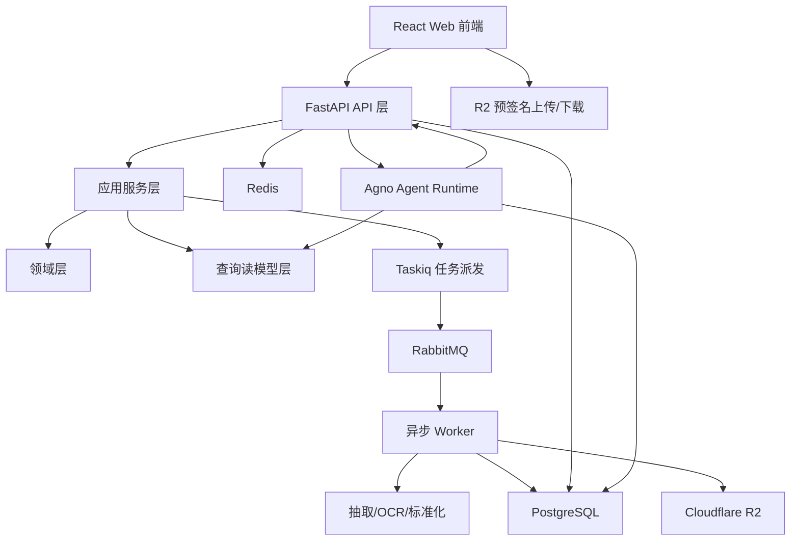
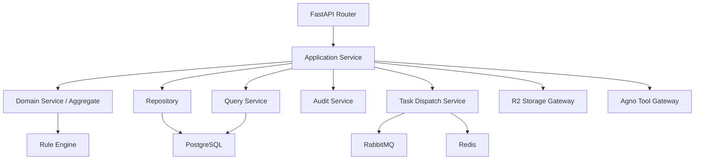
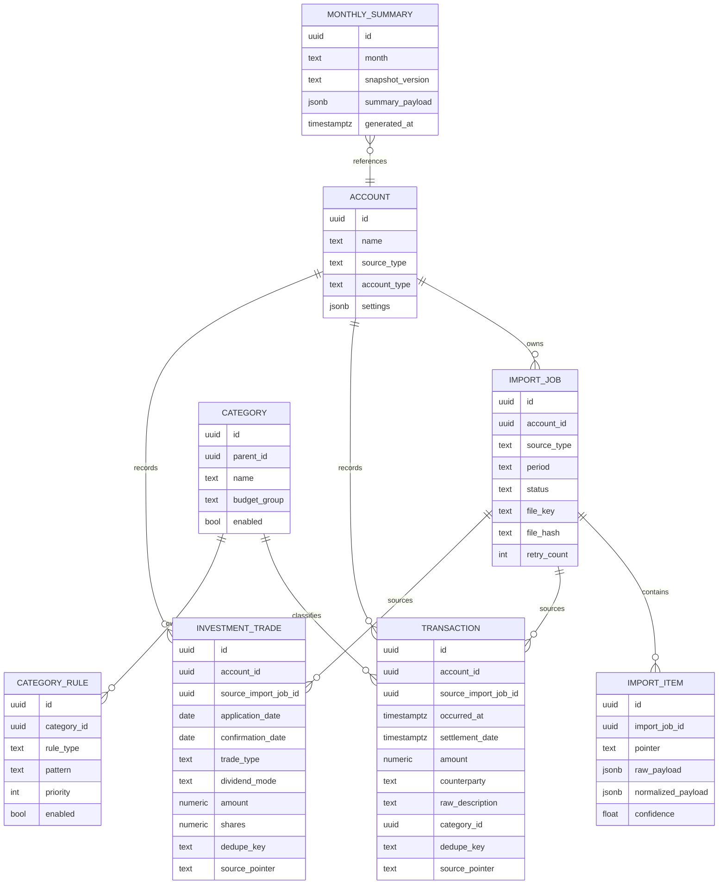

# FinAtlas 技术架构文档

## 1. 架构设计



### 1.1 分层说明
- 前端：React + TypeScript + Vite，负责页面交互、上传编排、筛选、报表展示与 AI 会话 UI
- API 层：FastAPI 提供鉴权、账户管理、导入任务、台账查询、分类管理、月报、AI 查询等接口
- 应用服务层：负责编排用例、事务边界、权限校验、审计与任务派发
- 领域层：沉淀导入状态机、去重规则、分类规则、月报口径、证据链与业务约束
- 异步任务层：Taskiq + RabbitMQ 驱动多阶段导入任务与快照生成
- 数据层：PostgreSQL 存储结构化数据与快照；R2 存储原始文件与中间产物；Redis 提供锁与幂等辅助
- AI 层：Agno 作为 Agent 编排运行时，通过内部工具访问受控查询接口，而非直接写数据库

## 2. 技术说明
- 前端：React 18 + TypeScript + Vite + React Router + Zustand + Tailwind CSS
- 后端：Python 3.12 + FastAPI + Pydantic + SQLAlchemy + Alembic
- 异步任务：Taskiq + taskiq-aio-pika + RabbitMQ
- 缓存与协调：Redis
- 数据库：PostgreSQL 16
- 对象存储：Cloudflare R2（私有桶 + presigned URL）
- AI 运行时：Agno
- 测试：Vitest、Playwright、Pytest、httpx
- 部署：Docker Compose 用于本地开发与联调

## 3. 路由定义
| 路由 | 用途 |
|------|------|
| / | Dashboard 首页 |
| /imports | 导入中心 |
| /ledger | 交易台账 |
| /investments | 投资台账 |
| /categories | 分类管理 |
| /reports/:month | 月报快照详情 |
| /ai | AI 助手 |
| /settings/accounts | 账户与来源配置 |
| /settings/audit | 审计日志 |

## 4. API 定义

### 4.1 核心接口分组
| 分组 | 接口用途 |
|------|----------|
| Auth | 登录、会话检查、登出 |
| Accounts | 账户、来源、模板映射、账期规则 |
| Imports | 上传授权、导入作业、复核、重试、作业详情 |
| Ledger | 交易查询、详情、手工补录、编辑 |
| Investments | 投资交易查询、聚合、分红视图 |
| Categories | 分类树、规则、命中统计、确认与回滚 |
| Reports | 月报快照生成、读取、下钻 |
| AI | 问答、引用证据、最近会话 |
| Audit | 审计日志、模型运行摘要 |

### 4.2 关键请求与响应结构
```ts
export type ImportJobStatus =
  | 'uploaded'
  | 'extracting'
  | 'normalizing'
  | 'deduping'
  | 'persisting'
  | 'needs_review'
  | 'completed'
  | 'failed'

export interface ImportJobSummary {
  id: string
  sourceType: 'bank_debit' | 'credit_card' | 'fund_platform'
  accountId: string
  period: string
  status: ImportJobStatus
  successCount: number
  duplicateCount: number
  failedCount: number
  reviewCount: number
  startedAt?: string
  finishedAt?: string
  lastError?: string
}

export interface TransactionItem {
  id: string
  occurredAt: string
  settlementDate?: string
  amount: string
  accountId: string
  counterparty: string
  rawDescription: string
  categoryId?: string
  sourceImportJobId: string
  sourcePointer: string
  dedupeKey: string
}

export interface AiAnswer {
  answer: string
  basis: string[]
  evidenceLinks: Array<{
    label: string
    targetRoute: string
  }>
  dataGaps: string[]
}
```

### 4.3 API 原则
- Command 与 Query 分离，写操作走应用服务，读操作优先走读模型
- AI 工具调用只访问受控查询接口和只读报表接口
- 上传先获取预签名 URL，再回调创建导入作业
- 所有写操作必须产生审计记录
- 所有错误必须返回明确错误码与可定位信息

## 5. 服务端架构图



## 6. 数据模型

### 6.1 数据模型定义


### 6.2 数据定义语言
```sql
CREATE TABLE account (
  id UUID PRIMARY KEY,
  name TEXT NOT NULL,
  source_type TEXT NOT NULL,
  account_type TEXT NOT NULL,
  settings JSONB NOT NULL DEFAULT '{}'::jsonb,
  created_at TIMESTAMPTZ NOT NULL DEFAULT NOW()
);

CREATE TABLE import_job (
  id UUID PRIMARY KEY,
  account_id UUID NOT NULL,
  source_type TEXT NOT NULL,
  period TEXT NOT NULL,
  status TEXT NOT NULL,
  file_key TEXT NOT NULL,
  file_hash TEXT NOT NULL,
  retry_count INT NOT NULL DEFAULT 0,
  last_error TEXT,
  created_at TIMESTAMPTZ NOT NULL DEFAULT NOW(),
  updated_at TIMESTAMPTZ NOT NULL DEFAULT NOW()
);
CREATE INDEX idx_import_job_account_period ON import_job(account_id, period);
CREATE INDEX idx_import_job_status ON import_job(status);

CREATE TABLE transaction (
  id UUID PRIMARY KEY,
  account_id UUID NOT NULL,
  source_import_job_id UUID NOT NULL,
  occurred_at TIMESTAMPTZ NOT NULL,
  settlement_date TIMESTAMPTZ,
  amount NUMERIC(18,2) NOT NULL,
  counterparty TEXT NOT NULL,
  raw_description TEXT NOT NULL,
  category_id UUID,
  dedupe_key TEXT NOT NULL,
  source_pointer TEXT NOT NULL,
  created_at TIMESTAMPTZ NOT NULL DEFAULT NOW(),
  UNIQUE(account_id, dedupe_key)
);
CREATE INDEX idx_transaction_occurred_at ON transaction(occurred_at);
CREATE INDEX idx_transaction_category_id ON transaction(category_id);

CREATE TABLE investment_trade (
  id UUID PRIMARY KEY,
  account_id UUID NOT NULL,
  source_import_job_id UUID NOT NULL,
  application_date DATE NOT NULL,
  confirmation_date DATE,
  trade_type TEXT NOT NULL,
  dividend_mode TEXT NOT NULL DEFAULT 'reinvest',
  amount NUMERIC(18,2),
  shares NUMERIC(18,6),
  fund_code TEXT,
  fund_name TEXT,
  dedupe_key TEXT NOT NULL,
  source_pointer TEXT NOT NULL,
  created_at TIMESTAMPTZ NOT NULL DEFAULT NOW(),
  UNIQUE(account_id, dedupe_key)
);
CREATE INDEX idx_investment_trade_application_date ON investment_trade(application_date);
CREATE INDEX idx_investment_trade_confirmation_date ON investment_trade(confirmation_date);

CREATE TABLE monthly_summary (
  id UUID PRIMARY KEY,
  month TEXT NOT NULL,
  snapshot_version TEXT NOT NULL,
  summary_payload JSONB NOT NULL,
  generated_at TIMESTAMPTZ NOT NULL DEFAULT NOW(),
  UNIQUE(month, snapshot_version)
);
```

## 7. 非功能设计
- 幂等性：上传文件按 file hash 去重，结构化记录按 account_id + dedupe_key 唯一约束兜底
- 可追溯：所有交易和投资记录都保留 source_import_job_id 与 source_pointer
- 可重试：导入状态机按步骤重入，失败时可从指定步骤重新开始
- 安全性：R2 私有桶、服务端凭据、预签名 URL、受控 AI 工具访问、完整审计日志
- 可观测性：Agno tracing、导入步骤耗时、队列积压、错误码、作业重试次数
- 可扩展性：单用户架构预留多用户扩展位，不在 MVP 过度引入租户复杂度

## 8. 实现建议
- 先完成可运行骨架：前端页面框架、FastAPI 基础、Docker Compose、数据库迁移、任务队列、环境模板
- 再完成核心闭环：账户 -> 导入 -> 台账 -> 分类 -> 月报 -> AI 问答
- 在 AI Provider 未配置前，保留 Agno 适配层、tool schema 与 mock response，以保证主流程可开发和可测试
