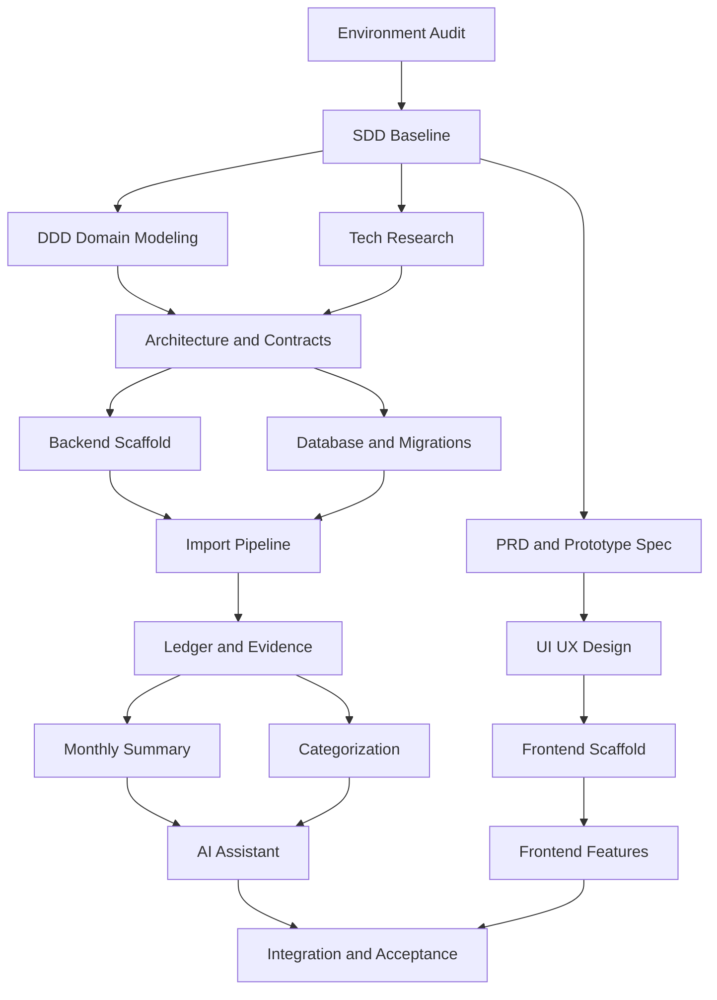

# Task DAG

## Mermaid

## Parallel Batches

| Batch | Tasks | Can Start When | Owner |
|---|---|---|---|
| 1 | Environment Audit, SDD Baseline | 已完成 | Leader |
| 2 | PRD, DDD, Tech Research, UI/UX | SDD baseline ready | PM, Domain, Architect, Designer |
| 3 | Frontend Scaffold, Backend Scaffold, Database and Migrations | Contracts frozen | Frontend, Backend |
| 4 | Import Pipeline, Ledger and Evidence | Scaffold ready | Backend |
| 5 | Categorization, Monthly Summary, AI Assistant, Frontend Features | Core data flow ready | FE, BE |
| 6 | Integration and Acceptance | Feature tasks pass review | QA, Integration Captain |

## Critical Path
- 环境审计
- SDD 基线
- DDD 与架构合同冻结
- 后端骨架与数据库迁移
- 导入状态机
- 台账与证据链
- 月报快照
- AI 助手
- 集成与验收

## Merge Order
- 共享文档与合同
- 工程骨架与环境
- 数据库迁移
- 导入与台账
- 分类与月报
- AI 与前端整合
- 测试、交付文档与联调

## Tasks

## Task T01: Frontend Scaffold
### Goal
建立 React + TypeScript + Vite 前端骨架与基础页面框架。
### Scope
包含：
- 路由
- 布局
- 设计 token
- 基础状态组件
不包含：
- 真实业务 API 打通
### Domain Context
- Bounded Context: UI Shell
- Aggregate:
- Business Rules:
### Dependencies
- DDD、API、UI/UX 文档
### Branch
`agent/t01-frontend-scaffold`
### Worktree
`.worktrees/t01-frontend-scaffold`
### Acceptance Criteria
- [ ] AC1: 可启动前端开发服务器
- [ ] AC2: 六个核心页面路由存在
- [ ] AC3: 基础布局与设计 token 生效
### Tests
- Unit: `npm run test`
- Integration: `npm run check`
- E2E: `npm run test:e2e`
- Manual: 打开首页、导入中心、AI 助手页面确认布局
### Files Expected
- `src/*`
- `package.json`
### Done Means
- 测试通过
- 文档已更新
- QA Reviewer PASS

## Task T02: Backend Scaffold
### Goal
建立 FastAPI、SQLAlchemy、Alembic、Taskiq 基础骨架。
### Scope
包含：
- app 包结构
- 配置系统
- 健康检查
- 基础鉴权
不包含：
- 完整业务实现
### Domain Context
- Bounded Context: Platform
- Aggregate:
- Business Rules:
### Dependencies
- 架构、数据库设计
### Branch
`agent/t02-backend-scaffold`
### Worktree
`.worktrees/t02-backend-scaffold`
### Acceptance Criteria
- [ ] AC1: API 服务可启动
- [ ] AC2: Worker 可启动
- [ ] AC3: Alembic 初始化完成
### Tests
- Unit: `pytest`
- Integration: `pytest -m integration`
- E2E: `docker compose up`
- Manual: 访问健康检查接口
### Files Expected
- `backend/*`
- `worker/*`
- `alembic/*`
### Done Means
- 测试通过
- 文档已更新
- QA Reviewer PASS

## Task T03: Import Pipeline
### Goal
实现上传会话、导入状态机、重试与复核主链路。
### Scope
包含：
- presigned 上传会话
- import_job 状态机
- 重试与错误落库
不包含：
- 完整 OCR 强化
### Domain Context
- Bounded Context: 导入与证据
- Aggregate: ImportJob
- Business Rules: BR-001, BR-002, BR-003, BR-005
### Dependencies
- T02, T04
### Branch
`agent/t03-import-pipeline`
### Worktree
`.worktrees/t03-import-pipeline`
### Acceptance Criteria
- [ ] AC1: 上传确认后创建导入作业
- [ ] AC2: 状态机可运行并支持失败重试
- [ ] AC3: 错误信息可定位到步骤或证据
### Tests
- Unit: `pytest tests/domain/test_import_job.py`
- Integration: `pytest tests/integration/test_import_pipeline.py`
- E2E: `docker compose up && pytest tests/e2e/test_import_flow.py`
- Manual: 上传样例文件并查看状态流转
### Files Expected
- `backend/imports/*`
- `tests/*`
### Done Means
- 测试通过
- Domain Reviewer PASS
- QA Reviewer PASS

## Task T04: Database and Migrations
### Goal
建立核心表结构、唯一约束和基础 seed。
### Scope
包含：
- 账户
- 导入作业
- 台账
- 分类
- 月报
不包含：
- 复杂统计物化优化
### Domain Context
- Bounded Context: Shared Data
- Aggregate: 多聚合存储
- Business Rules: BR-003, BR-004, BR-011
### Dependencies
- 数据库设计文档
### Branch
`agent/t04-database-migrations`
### Worktree
`.worktrees/t04-database-migrations`
### Acceptance Criteria
- [ ] AC1: 所有核心表可迁移
- [ ] AC2: 去重唯一约束生效
- [ ] AC3: 基础 seed 可导入
### Tests
- Unit: `pytest tests/db/test_schema.py`
- Integration: `pytest tests/integration/test_migrations.py`
- E2E: `docker compose up db`
- Manual: 执行迁移并查询表结构
### Files Expected
- `alembic/versions/*`
- `backend/models/*`
### Done Means
- 测试通过
- QA Reviewer PASS
