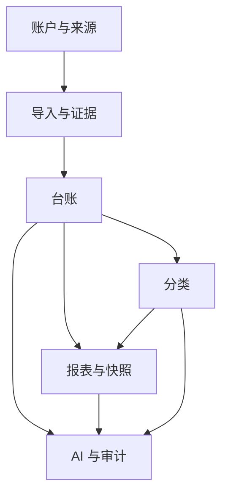

# Context Map

## 关系说明
- `账户与来源 -> 导入与证据`
  - 上游上下文：账户与来源
  - 下游上下文：导入与证据
  - 数据传递方式：同步读取账户配置与模板映射
  - 同步或异步：同步
  - 是否需要防腐层：否
  - 失败处理：来源配置缺失则拒绝创建导入作业
- `导入与证据 -> 台账`
  - 上游上下文：导入与证据
  - 下游上下文：台账
  - 数据传递方式：异步任务落库与领域事件
  - 同步或异步：异步
  - 是否需要防腐层：建议保留标准化适配层
  - 失败处理：失败记录作业状态并允许从步骤重试
- `台账 -> 分类`
  - 上游上下文：台账
  - 下游上下文：分类
  - 数据传递方式：同步查询与批量分类命令
  - 同步或异步：同步为主
  - 是否需要防腐层：否
  - 失败处理：分类失败不得破坏台账事实
- `台账/分类 -> 报表与快照`
  - 上游上下文：台账、分类
  - 下游上下文：报表与快照
  - 数据传递方式：异步汇总与快照生成
  - 同步或异步：异步生成，同步读取
  - 是否需要防腐层：否
  - 失败处理：快照失败不影响台账查询，但阻塞月报可用性
- `台账/分类/报表 -> AI 与审计`
  - 上游上下文：台账、分类、报表与快照
  - 下游上下文：AI 与审计
  - 数据传递方式：受控只读工具调用
  - 同步或异步：同步调用加异步记录 trace
  - 是否需要防腐层：是，使用 Tool Gateway 隔离 Agno
  - 失败处理：回答返回数据缺口或工具失败，不允许越权写业务数据
